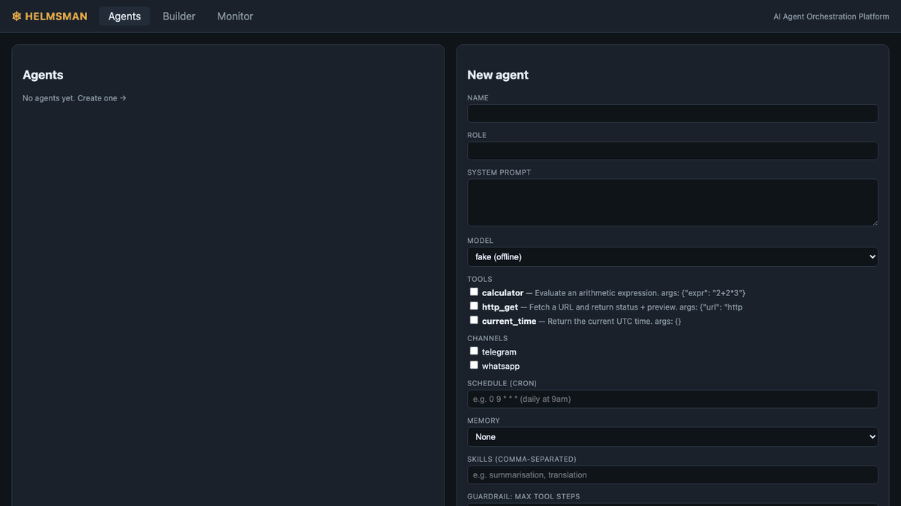
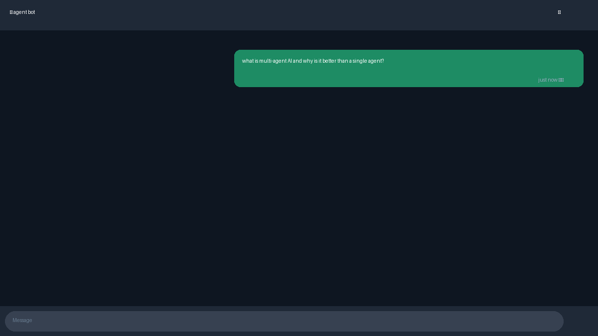

# Helmsman — AI Agent Orchestration Platform

Create AI agents, configure how they behave, wire them into collaborative
multi-agent workflows that run on a **real LangGraph runtime**, execute **real
tools**, talk to each other **asynchronously**, and are reachable by a human over
**Telegram** — all managed from a web UI, running **fully local** with one command.

---

## Quickstart

### Option A — one command (Docker)
```bash
cp .env.example .env        # add LLM_API_KEY / TELEGRAM_BOT_TOKEN
docker compose up --build   # Postgres + Redis + API + Web
```
- Web UI → http://localhost:5173
- API docs → http://localhost:8000/docs

Out of the box it runs with the offline `fake` model (no API key needed), so the
whole multi-agent flow works immediately. Add a real key to `.env` to use a live model.

### Option B — local dev (no Docker)
Backend uses SQLite + an in-memory bus automatically.
```bash
# from the project root
source .venv/bin/activate   # or: pip install -r server/requirements.txt
make dev-api                # starts uvicorn on :8000
make dev-web                # starts Vite on :5173 (separate shell)
```

---

## LLM providers

Set these three fields in `.env`:

| Provider | `LLM_PROVIDER` | `DEFAULT_MODEL` example | Notes |
|---|---|---|---|
| Fake (offline) | `fake` | `fake` | Default, no key needed |
| OpenRouter (free) | `openrouter` | `openai/gpt-oss-20b:free` | Key at openrouter.ai — many free models with `:free` suffix |
| Groq (free tier) | `groq` | `llama-3.1-8b-instant` | Key at console.groq.com |
| OpenAI | `openai` | `gpt-4o-mini` | Key at platform.openai.com |
| Anthropic | `anthropic` | `claude-haiku-3-5-20251001` | Key at console.anthropic.com |

---

## Telegram channel

1. Create a bot with [@BotFather](https://t.me/BotFather) and copy the token.
2. Set `TELEGRAM_BOT_TOKEN=<token>` in `.env`.
3. Restart the server — it uses long polling, so no public URL or tunnel is needed.
4. Message your bot; the reply comes from the default Concierge agent (or the workflow
   set via `CHANNEL_WORKFLOW_ID`). The exchange appears in the **Monitor** tab.

---

## Demo

### UI — Agent creation + multi-agent workflow run


*Creating an agent → loading the Research→Write→Review workflow → running a task → live Monitor output*

### Telegram — conversational agent over messaging


*User sends a message → 3-agent workflow runs → reply streamed back → Monitor shows live run history*

---

## Try it in 60 seconds
1. Open the UI → **Builder** tab → click **+ Research → Write → Review** to instantiate the template.
2. Type a task (e.g. *"Write a launch tweet for feature X"*) and hit **Run ▶**.
3. Switch to **Monitor** to watch inter-agent messages, the run log, and live token/cost.

---

## API

Base URL: `http://localhost:8000` — all bodies are JSON.

### Agents
| Method | Endpoint | Description |
|---|---|---|
| `POST` | `/api/agents` | Create an agent |
| `GET` | `/api/agents` | List all agents |
| `GET` | `/api/agents/tools` | List available tools (calculator, http_get, current_time) |
| `GET` | `/api/agents/{id}` | Get a single agent |
| `PATCH` | `/api/agents/{id}` | Update agent fields |
| `DELETE` | `/api/agents/{id}` | Delete an agent |

### Templates
| Method | Endpoint | Description |
|---|---|---|
| `GET` | `/api/templates` | List built-in templates |

### Workflows
| Method | Endpoint | Description |
|---|---|---|
| `POST` | `/api/workflows/from-template` | Instantiate a template as a saved workflow |
| `GET` | `/api/workflows` | List all workflows |
| `GET` | `/api/workflows/{id}` | Get a workflow including full graph_spec |
| `PATCH` | `/api/workflows/{id}` | Update name, description, or graph_spec |
| `POST` | `/api/workflows/{id}/run` | Execute a workflow — blocks until all agents finish |

### Runs
| Method | Endpoint | Description |
|---|---|---|
| `GET` | `/api/runs?limit=N` | List recent runs, newest first (default limit 50) |
| `GET` | `/api/runs/{id}` | Get run detail with all messages and per-agent token usage |

### WebSocket
| | Endpoint | Description |
|---|---|---|
| `WS` | `/ws/events` | Live stream of all run events |

### Health
| Method | Endpoint | Description |
|---|---|---|
| `GET` | `/health` | Server status, active LLM provider, Telegram state |

---

## WebSocket — how it works

`WS /ws/events` is a **passive subscriber** — the browser connects once and then
waits. Events are pushed automatically whenever a workflow run executes.

```
Browser connects to WS /ws/events
        │
        └── bus.subscribe() opens a Queue — sits idle

POST /api/workflows/{id}/run called
        │
        └── each node/tool/LLM step calls bus.publish(event)
                    │
                    └── event is put into every subscriber's Queue
                                │
                                └── ws.py forwards it to the browser as JSON
```

Event types received on the socket:

| type | Fired when |
|---|---|
| `run_start` | Execution begins |
| `node_start` | An agent node starts processing |
| `tool_call` | An agent called a tool; includes the observation |
| `usage` | After each LLM call; includes cumulative token + cost totals |
| `node_end` | A node finished; includes its final output |
| `agent_message` | An inter-agent message was recorded |
| `guardrail` | Token ceiling reached or tool blocked |
| `run_end` | Run finished; includes final output and totals |

Multiple browser tabs can connect simultaneously — all receive the same events.

---

## What's implemented

| Feature | Where |
|---|---|
| Agent CRUD (name, role, prompt, model, tools, interaction rules, guardrails) | `server/app/api/agents.py`, UI **Agents** tab |
| Visual workflow builder with conditions + feedback loops | `web/src/pages/BuilderPage.tsx` + `server/app/runtime/compiler.py` |
| 2 pre-built templates | `server/app/templates/builtin.py` (research-loop, triage-routing) |
| Real runtime executing agent logic | LangGraph `StateGraph` in `compiler.py` / `nodes.py` |
| Real tool execution | `server/app/runtime/tools.py` (calculator, http_get, current_time) |
| Async agent-to-agent communication | `server/app/runtime/bus.py` (in-memory / Redis Streams) |
| External channel (Telegram) | `server/app/channels/telegram.py` (long polling) |
| Persisted, UI-visible message history | `Message`/`Run` tables, **Monitor** tab |
| Live monitoring: logs, inter-agent messages, token/cost | WebSocket `/ws/events` → **Monitor** tab |
| Tests for critical paths | `server/tests/` |

---

## Why LangGraph?

The challenge required integrating one of: openclaw.ai, LangGraph, CrewAI, AutoGen, or a custom runtime.

**LangGraph was chosen for three reasons:**

1. **Cycles and conditional edges as first-class primitives.** The core requirement — feedback loops between agents (e.g. Reviewer → Writer → Reviewer) — maps directly onto LangGraph's `StateGraph` with `add_conditional_edges`. CrewAI and AutoGen model agent interaction as sequential pipelines or conversation threads, not arbitrary directed graphs with cycles. Implementing a feedback loop in those frameworks requires workarounds; in LangGraph it is the natural model.

2. **Explicit, inspectable state.** Every node receives and returns a typed `GraphState` dict. This makes it straightforward to track shared context (conversation history, per-node outputs, step count) across agents, stream it onto an event bus, and persist it to the database. Frameworks that hide state inside the framework internals make this kind of transparency harder.

3. **Clean separation from the rest of the stack.** LangGraph compiles a `graph_spec` dict into a runnable app via a single function (`compile_graph`). The rest of the platform — the REST API, the WebSocket hub, the Telegram channel — never imports LangGraph directly. Swapping the runtime in the future requires changing only `compiler.py` and `nodes.py`.

**Tradeoffs:** LangGraph is lower-level than CrewAI or AutoGen — there is no built-in agent persona management, tool registry, or memory store. Those concerns are handled explicitly by Helmsman's own layers (`nodes.py`, `tools.py`, `db/`), which keeps the architecture transparent but requires more code than a higher-level framework would.

---

## Architecture

```
 React + React Flow (web/)                FastAPI (server/app/api)
 ┌───────────────────────┐    REST/WS    ┌──────────────────────────┐
 │ Agents · Builder ·     │◄────────────►│ routers + WebSocket hub   │
 │ Monitor                │              │ orchestrator              │
 └───────────────────────┘              └────────────┬─────────────┘
                                                      │ compiles graph_spec
                                          ┌───────────▼─────────────┐
            Telegram (long-poll) ───────► │ LangGraph runtime        │
                                          │ nodes · tools · guardrails│
                                          └─────┬───────────────┬────┘
                                  events/messages│               │ state
                                          ┌──────▼──────┐  ┌─────▼──────┐
                                          │ Bus (memory │  │ PostgreSQL  │
                                          │  / Redis)   │  │ / SQLite    │
                                          └─────────────┘  └────────────┘
```

**UI** (`web/`) only talks to the API. **Runtime** (`server/app/runtime/`) compiles
and executes graphs. **Persistence** (`server/app/db/`) is the source of truth.
The seam between builder and runtime is `compiler.compile_graph(graph_spec → StateGraph)`.

---

## How a workflow runs
1. The builder serializes the canvas to a `graph_spec` (nodes = agents, edges = routing).
2. `compile_graph` turns it into a LangGraph `StateGraph` — conditional edges become
   routers, loop-back edges become cycles.
3. Each node calls its LLM, runs a bounded real-tool loop, enforces guardrails
   (tool allowlist, token ceiling), and publishes its output onto the bus.
4. The executor persists the run, every message, and per-call token/cost usage.
5. The WebSocket hub streams every bus event live to the Monitor tab.

---

## Extending

**Add a messaging channel** — implement `start` and `send` from
`server/app/channels/base.py`, add a file beside `telegram.py`, and register it.

**Add a workflow template** — append a graph_spec dict to
`server/app/templates/builtin.py`; it appears in the builder's template picker
automatically via `/api/templates`.

**Add a tool** — add a function and registry entry in `server/app/runtime/tools.py`;
it becomes selectable in the agent config UI.

**Add an LLM provider** — add an `elif self._provider == "<name>"` branch in
`server/app/runtime/llm.py` using any LangChain chat model.

---

## Tests
```bash
cd server && PYTHONPATH=. pytest -q
```
Covers agent CRUD, workflow execution (conditional edge + feedback loop + persistence),
message delivery (inbound channel → runtime → persisted history), and bus event streaming.

---

## Documentation

The `docs/` directory contains:

| File | Contents |
|---|---|
| `docs/DOCUMENTATION.md` | Full platform documentation with architecture, tab-by-tab UI walkthrough, data model, and extension guide |
| `docs/screenshots/` | UI screenshots for all three tabs (Agents, Builder, Monitor) and Telegram bot conversations |
| `docs/screenshots/demo/` | Step-by-step screenshots of the 3-agent Research → Write → Review live demo run |
