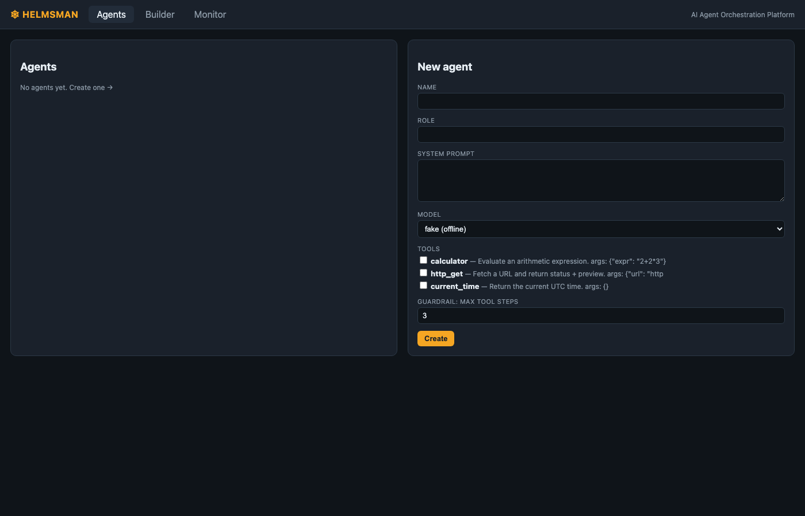
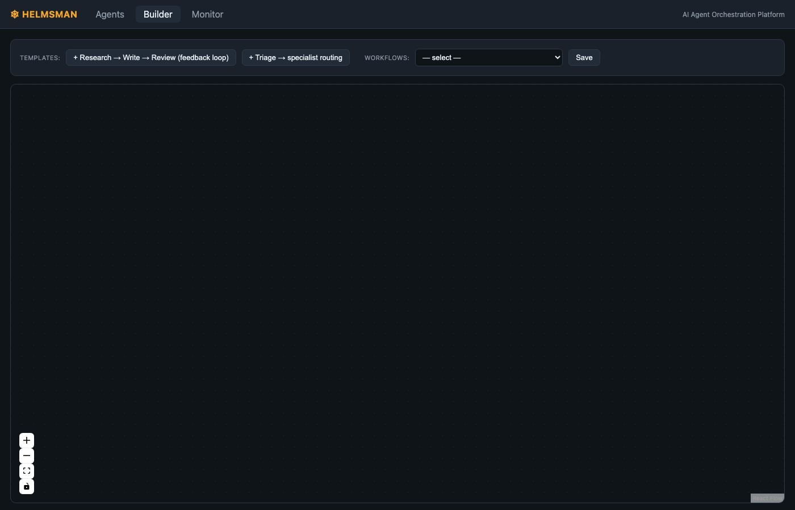
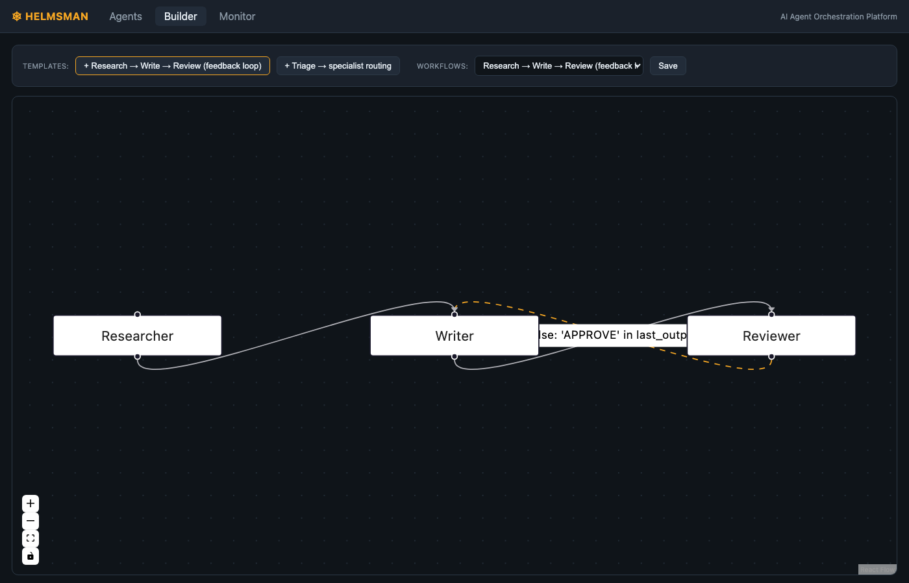
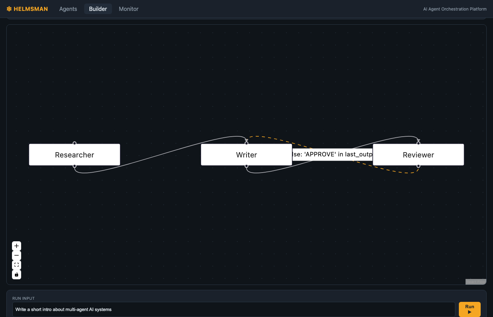
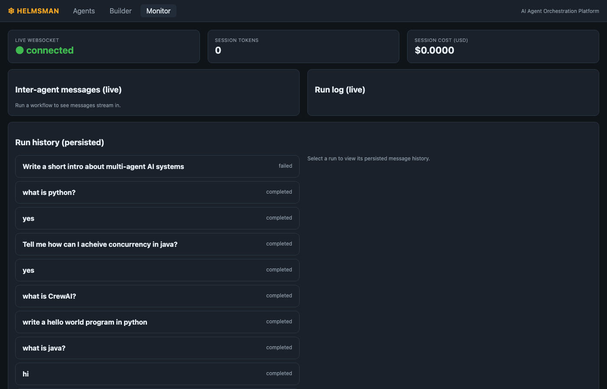

# Helmsman — Platform Documentation

## Overview

Helmsman is a local AI agent orchestration platform. You define agents, wire them into multi-agent workflows on a visual canvas, run them against a real LangGraph execution engine, and observe every message and token live in a monitoring dashboard. Workflows are also reachable over Telegram — no public URL required.

---

## Architecture

```
┌─────────────────────────────────────────────────────────────────┐
│  Browser (React + React Flow)                                    │
│  Agents tab · Builder tab · Monitor tab                         │
└───────────────────────┬─────────────────────────────────────────┘
              REST + WebSocket
┌───────────────────────▼─────────────────────────────────────────┐
│  FastAPI  (server/app/)                                          │
│  /api/agents   /api/workflows   /api/runs   /api/templates       │
│  /ws/events  ← streams all run events to the browser            │
│  orchestrator  ← routes inbound Telegram messages to runtime    │
└───────────────────────┬─────────────────────────────────────────┘
                        │ compile graph_spec → StateGraph
┌───────────────────────▼─────────────────────────────────────────┐
│  LangGraph runtime  (server/app/runtime/)                        │
│  compiler  →  nodes  →  llm  →  tools  →  bus                  │
└──────────┬──────────────────────────────────────┬───────────────┘
           │ events / messages                     │ state
┌──────────▼──────────┐               ┌────────────▼──────────────┐
│ Async Bus           │               │ SQLite / PostgreSQL        │
│ memory or Redis     │               │ agents · workflows         │
└─────────────────────┘               │ runs · messages · usage    │
                                      └───────────────────────────┘
Telegram (long-poll) ──────────────► orchestrator ──► runtime
```

**Three clean layers:**
- **UI** (`web/`) — never touches the database; speaks REST and WebSocket only.
- **Runtime** (`server/app/runtime/`) — compiles and executes graphs; pure with respect to HTTP.
- **Persistence** (`server/app/db/`) — SQLAlchemy ORM; the source of truth for all state.

---

## The Three Tabs

### 1. Agents



The **Agents** tab is where reusable agent personas live. Each agent has:

| Field | Purpose |
|---|---|
| **Name** | Identifier used in graph nodes and inter-agent messages |
| **Role** | Short label injected into the system prompt |
| **System Prompt** | Full persona instruction for the LLM |
| **Model** | `fake` (offline), `gpt-4o-mini`, `llama-3.1-8b-instant`, etc. |
| **Tools** | Checkboxes for `calculator`, `http_get`, `current_time` |
| **Guardrail: Max Tool Steps** | Caps the tool-call loop per node invocation |

Agents created here can be referenced by ID in any workflow node. Workflow templates embed inline agent configs so they work without any pre-seeded agents.

---

### 2. Builder

#### Empty canvas



The canvas starts blank. The toolbar across the top shows:
- **TEMPLATES** — one-click instantiation of pre-built workflows.
- **WORKFLOWS** — dropdown to load a previously saved workflow onto the canvas.
- **Save** — persists the current canvas as a workflow via `PATCH /api/workflows/{id}`.

The bottom-left corner has React Flow controls: zoom in, zoom out, fit view, lock.

#### Workflow loaded — Research → Write → Review



Clicking **+ Research → Write → Review (feedback loop)** instantiates the template and renders three nodes on the canvas:

- **Researcher** — gathers facts; has `http_get` and `current_time` tools available.
- **Writer** — drafts from the research; revises if the Reviewer sends it back.
- **Reviewer** — evaluates the draft; routes conditionally:
  - **solid line** (Researcher → Writer, Writer → Reviewer) — unconditional edges.
  - **dashed orange line** (Reviewer → Writer) — the feedback loop; fires when the condition `'APPROVE' not in last_output.upper() and steps < 6` is true.

The condition expression `'APPROVE' in last_output.upper() or steps >= 6` is evaluated by `compiler._make_router` at runtime against live graph state — no code changes needed to adjust it.

#### Run panel



The **RUN INPUT** panel at the bottom accepts a task prompt. Hitting **Run ▶** calls `POST /api/workflows/{id}/run`, which:
1. Creates a `Run` record in the database with `status = "running"`.
2. Compiles the `graph_spec` into a LangGraph `StateGraph`.
3. Invokes the graph; each node calls its LLM, optionally calls tools, and emits events onto the bus.
4. The browser receives every event in real-time over the `/ws/events` WebSocket.
5. On completion the run is written back with `status = "completed"` and the final output.

---

### 3. Monitor



The **Monitor** tab has three sections:

**Status bar (top row)**
- **Live WebSocket** — green `● connected` when the `/ws/events` socket is open. Events stream in as they happen.
- **Session tokens** — cumulative token count across all runs since the browser tab opened.
- **Session cost (USD)** — cumulative cost calculated from per-model pricing in `callbacks.py`.

**Inter-agent messages (live)** — streams `agent_message` bus events in real time. Each entry shows sender → recipient and the message content. Useful for watching agents hand off work mid-run.

**Run log (live)** — every bus event (`run_start`, `node_start`, `node_end`, `tool_call`, `usage`, `run_end`) appears as a timestamped log line while the run is in progress.

**Run history (persisted)** — lists all completed runs from the database (`GET /api/runs`). Clicking a row loads the full persisted message history, token usage, and cost for that run. The screenshot shows real runs from the Telegram bot channel (e.g. *"what is python?"*, *"Tell me how can I achieve concurrency in java?"*) — each Telegram message creates its own persisted run.

---

## How a Run Executes

```
User input (UI or Telegram)
        │
        ▼
run_persisted()               ← creates Run record, status=running
        │
        ▼
execute_spec()
  ├─ compile_graph(graph_spec)      ← StateGraph with conditional edges
  └─ graph.ainvoke(state)
        │
        ▼  for each node:
make_agent_node()
  ├─ _build_system(agent)           ← system prompt + tool docs
  ├─ _build_messages(state)         ← TASK + conversation history
  └─ tool loop (up to max_tool_steps):
        llm.ainvoke()
        if CALL <tool> → run_tool() → OBSERVATION
        else → final output, break
  └─ record_message() + emit()      ← persisted + streamed to bus
        │
        ▼
_persist_results()            ← messages + usage written to DB
Run.status = completed
```

---

## Telegram Channel

The Telegram adapter (`channels/telegram.py`) runs as a background asyncio task on server startup. It uses **long polling** (`getUpdates` with a 50-second timeout) — no webhook, no public URL, no tunnel needed.

Each Telegram chat ID becomes the `thread_id` for the run, giving each conversation its own persistent context. Inbound messages route through `orchestrator.handle_inbound()` which picks either the workflow configured via `CHANNEL_WORKFLOW_ID` or the default Concierge agent.

---

## Data Model

```
Agent          — persona library (name, role, prompt, model, tools, guardrails)
Workflow       — saved graph_spec (nodes + edges + recursion_limit)
Run            — one execution (input, output, status, timing)
  └─ Message   — every inter-agent + human + tool message in the run
  └─ Usage     — per-node token counts and cost
```

---

## Extending

**New channel** — implement `start(on_message)` and `send(conversation_id, text)` from `channels/base.py`, drop the file beside `telegram.py`, and wire it up in `main.py`.

**New template** — append a `graph_spec` dict to `templates/builtin.py`; it appears in the Builder template picker automatically.

**New tool** — add a function and a `Tool` entry to `REGISTRY` in `runtime/tools.py`; it becomes a selectable checkbox in the Agents form.

**New LLM provider** — add an `elif self._provider == "<name>"` branch in `runtime/llm.py` using any LangChain chat model; add the provider name to `LLM_PROVIDER` docs in `.env.example`.
